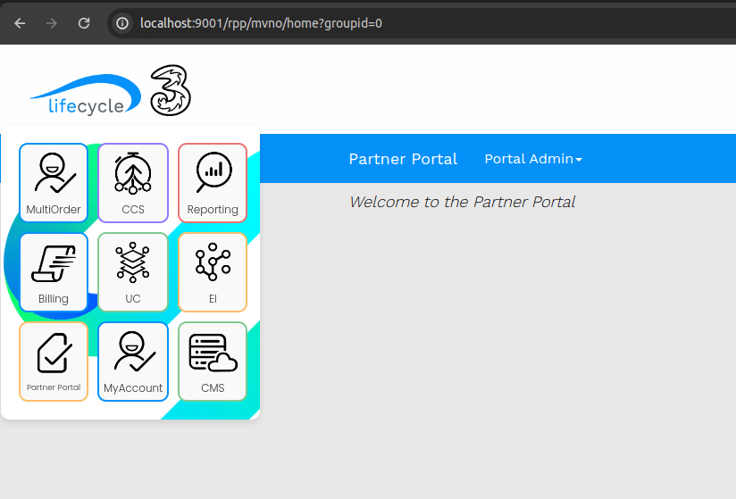
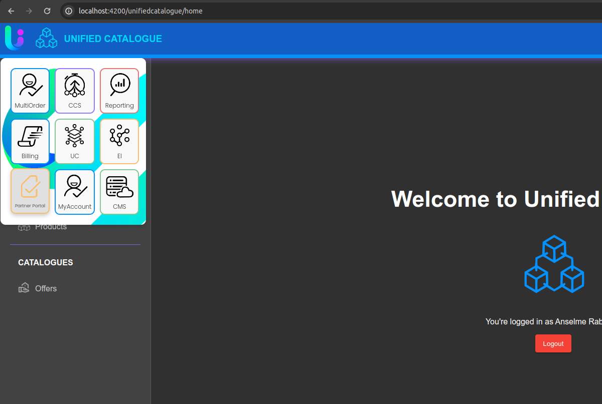

# AppDrawer Web Component

Sample of code of an app drawer component for navigation and quick access to various application features.





## Usage

### Basic Usage

```html
<button id="toggle-drawer">Toggle Drawer</button>
<app-drawer trigger="#toggle-drawer"></app-drawer>
```

### Customizing Position
```html
<style>
  app-drawer {
    --drawer-position: fixed;
    --drawer-top: 20px;
    --drawer-right: 20px;
  }
</style>

<button id="toggle-drawer">Toggle Drawer</button>
<app-drawer trigger="#toggle-drawer"></app-drawer>
```

### Adding Menu Items
Menu items can be configured with links that open in a new page:
```html
<app-drawer trigger="#toggle-drawer">
  <div class="menu-item">
    <a href="https://example.com" target="_blank">
      <div class="icon icon-example"></div>
      <span class="text">Example</span>
    </a>
  </div>
</app-drawer>
```

### Javascript Example
You can control the drawer's visibility programmatically:
```javascript
const drawer = document.querySelector('app-drawer');

// Show the drawer
drawer.show();

// Hide the drawer
drawer.hide();
```

## Development
### Building
To build the project, use the following command:
```bash
npm run build
```